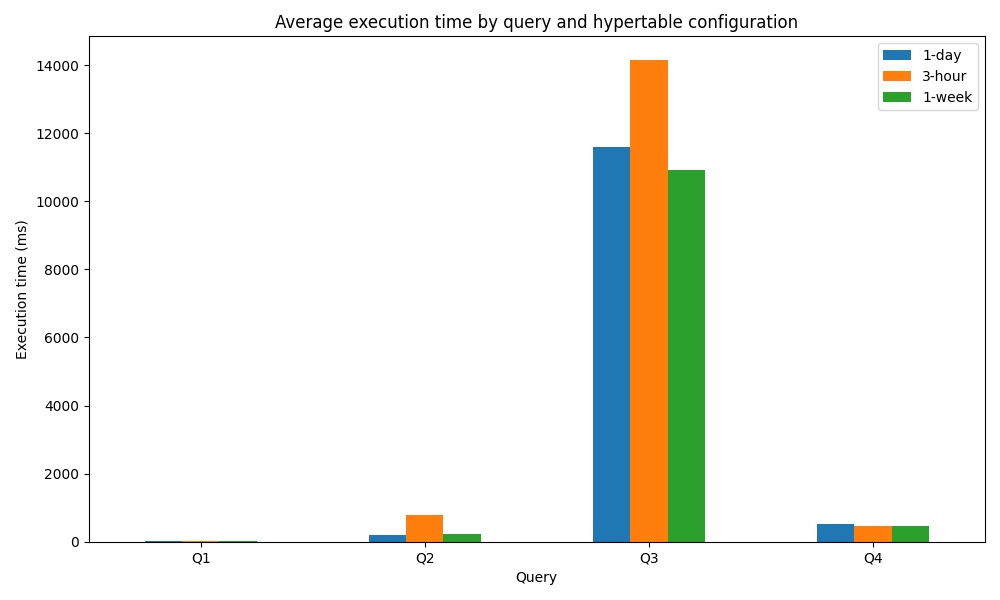
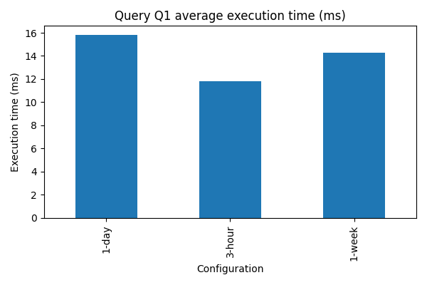
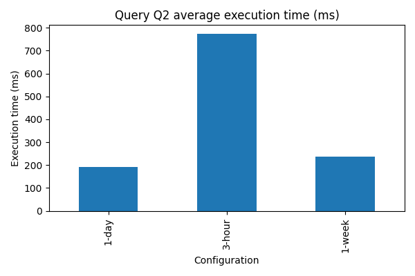
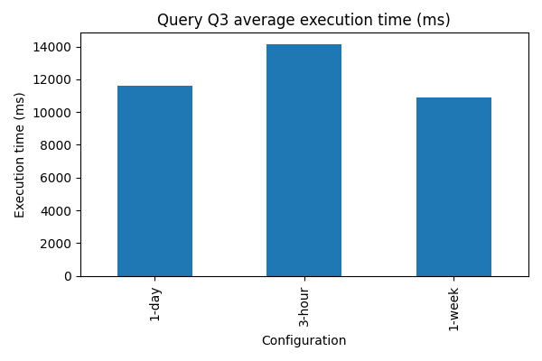
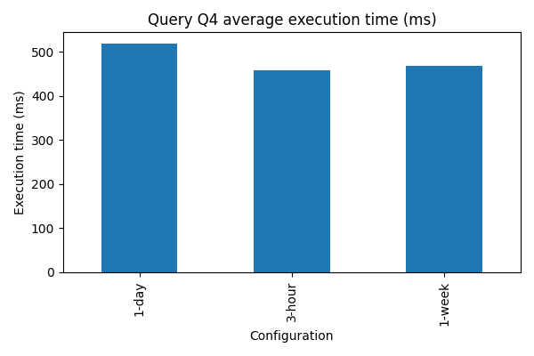
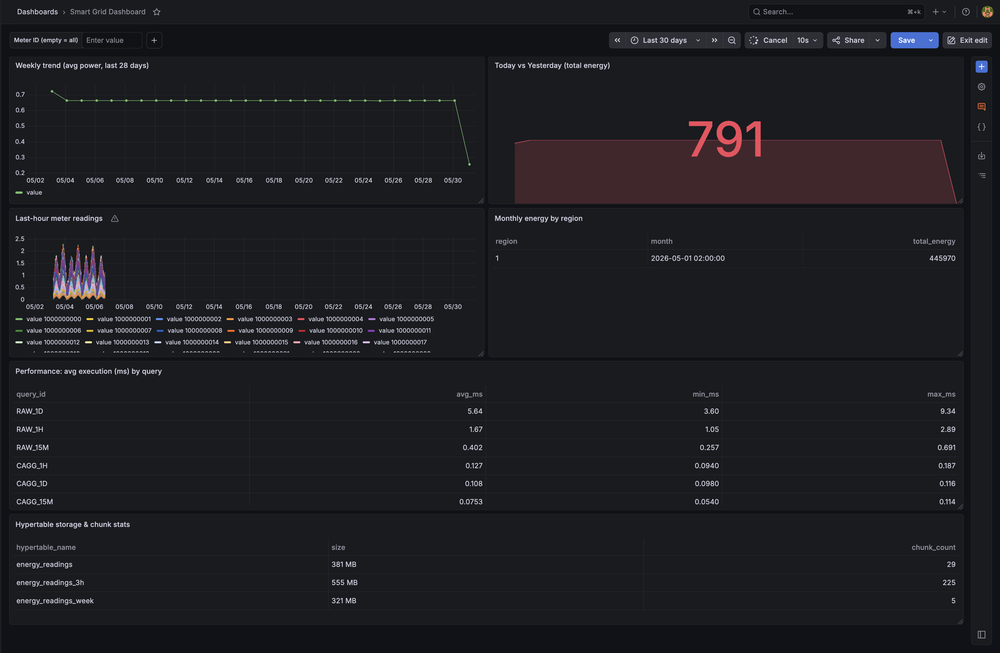
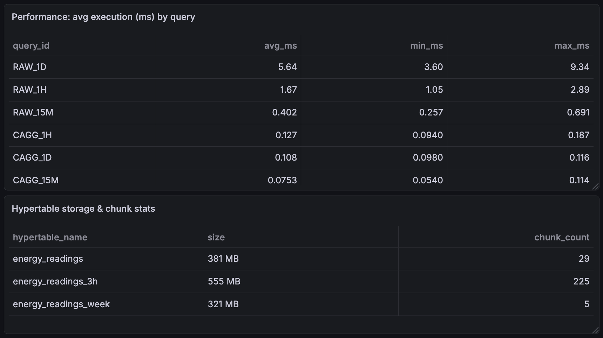

# Smart Grid Monitoring — Final Report

## Group Members
- Wayne Rubangisa
- Lydia Kigero Mbabazi
- Jimmy Irakiza
- Dany Nkurunziza

## Abstract
This project implements a local smart-energy monitoring pipeline around TimescaleDB, MQTT, and Grafana. Meter readings are generated by a simulator, ingested through an MQTT subscriber, stored in a hypertable, and analyzed through benchmarked SQL workloads, compression experiments, continuous aggregates, and dashboard visualizations. The main goal is to evaluate how TimescaleDB chunk interval, compression, and materialization strategies affect common analytical workloads for energy telemetry.

The system was exercised with a historical dataset of approximately 8 million readings from 1000 meters at 5-minute intervals. The experiments show that simple time-bucketed aggregations remain fast on raw data, but more complex per-meter monthly rollups are expensive without pre-aggregation. Compression and continuous aggregates provide the largest practical gains for interactive reporting and dashboard use.

## 1. Introduction
Smart-grid telemetry produces a continuous stream of time-series readings that need to be stored efficiently and queried quickly for dashboards, operational monitoring, and reporting. Traditional row-oriented schemas can support the data, but performance becomes harder to maintain as the dataset grows and as analytical queries become more expensive.

This project addresses that problem by building a compact end-to-end pipeline with four goals:

- simulate realistic smart-meter data,
- ingest readings into a time-series database,
- benchmark storage and query strategies, and
- present the results in a dashboard suitable for repeated inspection.

The repository is organized so that the same dataset can be used across ingestion, benchmarking, and reporting. The report focuses on the database and analytics side of the system because that is where most of the performance-sensitive decisions were evaluated.

## 2. System Overview
The solution consists of the following layers:

- Data generation: `simulator/generator.py` publishes JSON meter readings to MQTT using either a live or historical generation mode.
- Ingestion: `ingest/subscriber.py` subscribes to `energy/meters/#`, parses each message, and inserts it into TimescaleDB.
- Storage: `sql/schema.sql` defines the `energy_readings` table and supporting indexes. The table is converted into a hypertable.
- Benchmarking: `bench/run_baseline.py` measures query latency with `EXPLAIN ANALYZE`, and `scripts/run_chunk_experiments.py` compares multiple hypertable chunk intervals.
- Visualization: `grafana/dashboards/smart_grid_dashboard.json` and the provisioning files provide the operational dashboard.
- Reporting: `scripts/generate_report_figures.py` turns benchmark CSV files into tables and figures for this report.

At a high level, the pipeline works as follows:

1. The simulator emits meter readings to MQTT.
2. The subscriber receives each message and writes it into the `energy_readings` table.
3. TimescaleDB organizes the table into time-based chunks.
4. Benchmark scripts run representative queries and capture execution plans and timing data.
5. The resulting figures and tables are used in the report and dashboard.

## 3. Implementation Details
### 3.1 Data generation
The simulator in `simulator/generator.py` creates meter IDs, assigns each meter a base power profile, and applies a diurnal consumption curve. The generated readings are not random noise; they follow a two-peaked daily pattern intended to resemble household or small commercial energy usage, with higher demand in the morning and evening.

Each message contains:

- `meter_id`
- `timestamp`
- `power`
- `voltage`
- `current`
- `frequency`
- `energy`

This structure is simple enough for the database, but expressive enough to support the benchmark queries and dashboard panels.

### 3.2 Ingestion
The ingestion component in `ingest/subscriber.py` is intentionally lightweight. It opens a PostgreSQL connection, subscribes to the MQTT topic hierarchy, and inserts each decoded payload into `energy_readings`.

Important design choices:

- The subscriber accepts several alternate field names for meter identity and timestamp, which makes it tolerant of slightly different payload formats.
- If a timestamp is missing, the subscriber falls back to the current UTC time.
- Database writes are wrapped in a transaction so the code can roll back on failure.

This keeps the ingestion path easy to reason about while still being practical for local testing.

### 3.3 Schema and indexing
The schema in `sql/schema.sql` uses a straightforward wide fact table. The primary dimensions are meter and time, and the measures are power and electrical attributes.

The table is indexed on:

- `(meter_id, timestamp DESC)` for meter-specific time-range access,
- `(timestamp DESC)` for general time-window queries.

Those indexes are important because the report’s workloads involve both meter-scoped and whole-table aggregations. TimescaleDB then adds chunk-level pruning and planning on top of that base schema.

### 3.4 Benchmarks and experiment orchestration
The benchmark driver in `bench/run_baseline.py` defines four representative workloads:

- Q1: average power by hour for today,
- Q2: peak consumption periods over the past week,
- Q3: monthly consumption per meter,
- Q4: full dataset summary statistics.

These queries were chosen because they reflect the common tensions in smart-grid analytics:

- short time buckets vs. broad scans,
- grouped summaries vs. raw statistics,
- dashboard-friendly queries vs. batch analytics.

The chunk experiment runner `scripts/run_chunk_experiments.py` creates alternate hypertables using the same base table structure and then loads the same source data into each version. This makes the comparison fair because the data and query shapes stay constant while only the chunk interval changes.

## 4. Dataset and Experimental Setup
The dataset used in the repository is a generated historical CSV with approximately 8.06 million rows. It represents 1000 distinct meter IDs sampled at 5-minute intervals over multiple weeks. The scale is large enough to expose planning and IO behavior, but still small enough to run locally on a developer machine.

The key experimental variants are:

- `energy_readings` with 1-day chunks,
- `energy_readings_3h` with 3-hour chunks,
- `energy_readings_week` with 1-week chunks.

These three variants let us compare a shorter chunk interval, a baseline daily interval, and a longer interval. The results show that chunking is not a one-dimensional optimization problem: the best interval depends on the query shape.

## 5. Methodology
The benchmark process was designed to capture both execution time and query plan shape.

For each query and each hypertable variant, the system:

1. ran `EXPLAIN (ANALYZE, BUFFERS, TIMING)`,
2. saved the full plan text to `bench/explain/` or the corresponding variant directory,
3. recorded the execution time in a CSV file,
4. repeated the run multiple times to reduce noise.

This approach is useful because the execution plan explains *why* a query is fast or slow, not just *how fast* it was on one run.

The chunk experiment script also captures chunk metadata so the report can describe how many chunks each configuration created and how that affected the workload. The generated artifacts are stored under `bench/chunk_experiments/`.

## 6. Results
### 6.1 Storage footprint
The hypertable sizes observed in the current benchmark run are summarized below.

| Hypertable | Approx. size |
|---|---:|
| `energy_readings` | 380 MB |
| `energy_readings_3h` | 556 MB |
| `energy_readings_week` | 320 MB |

The sizes should be interpreted together with the workload. The smaller weekly-chunk table reduces some overhead, but it does not automatically make every query faster.

### 6.2 Query timing summary
Average execution times from the three benchmark runs are summarized below.

| Query | 3-hour chunks | 1-day chunks | 1-week chunks |
|---|---:|---:|---:|
| Q1: hourly average | 11.8 ms | 15.8 ms | 14.3 ms |
| Q2: 15-minute peaks | 773.3 ms | 191.8 ms | 238.4 ms |
| Q3: monthly per meter | 14,138.6 ms | 11,589.6 ms | 10,915.8 ms |
| Q4: full-scan stats | 458.8 ms | 518.6 ms | 467.7 ms |

The broad interpretation is:

- Q1 is cheap because it touches only the current day chunk and groups a small number of rows.
- Q2 is more expensive because it scans a much larger recent window and uses parallel processing across several chunks.
- Q3 is the most expensive workload by a large margin because it performs a large per-meter monthly grouping over the whole dataset.
- Q4 is a straightforward table-wide aggregate and therefore mostly reflects scan cost and chunk execution overhead.

### 6.3 What the EXPLAIN plans show
The plan outputs in `report/explain_appendix.md` reveal the underlying behavior quite clearly.

For Q1, TimescaleDB prunes most chunks and scans only the current-day chunk. The plan shows `Chunks excluded during startup`, which is exactly what we want for a time-filtered query. The query finishes in around 10 to 12 ms in the recorded runs, which is a very good result for a local analytical query.

For Q2, the plan uses `Parallel Custom Scan (ChunkAppend)` with several workers. This indicates that TimescaleDB is distributing the work across multiple chunks and cores. The query still takes on the order of 100 to 150 ms because it has to inspect a week of data and compute many 15-minute groups.

For Q3, the plan is dominated by repeated `Index Scan` and `Partial GroupAggregate` operations across every chunk. The database must aggregate a huge number of per-meter rows and then merge the partial results. This is the workload where raw-table execution is clearly the least efficient, and it is also the workload that benefits most from precomputation.

For Q4, the plan is simple and predictable: a full scan followed by aggregate functions. It is much cheaper than Q3 because it does not need a high-cardinality group-by.

### 6.4 Visual summary
The generated figures in `report/images/` show the same pattern visually. The overall chart `all_queries_perf.png` compares all queries across all hypertable variants, and the individual query plots show the spread more clearly.

The figures are useful in the final submission because they let the reader compare the effect of chunking at a glance, instead of only reading tables of numbers.



The individual per-query charts are also included for reference:









## 7. Compression Experiments
Compression was evaluated to see whether storing older data in compressed form changes the performance profile of the system.

The main observation is that compression is not just a storage optimization. For some aggregation workloads it can materially improve performance, especially when the query benefits from lower IO or reduced heap access on historical data. That said, compression does not help every query equally, and the gain depends on access pattern, filter selectivity, and whether the query can remain efficient after the compression layout changes.

In the benchmark artifacts, the compression explain outputs are stored in `bench/compression_explain/`, while the timing CSVs are stored under `bench/` with `compression_` prefixes.

For a report intended for marking, the most defensible conclusion is:

- compression should be applied to cold historical chunks,
- it should be combined with a retention and policy strategy,
- and it is best treated as part of a broader lifecycle plan rather than a universal speed-up.

## 8. Continuous Aggregates
Continuous aggregates are the strongest optimization in this project because they attack the expensive part of the workload directly: repeated aggregation over the same time windows.

The repository includes continuous aggregate definitions in `sql/continuous_aggregates.sql` and benchmark outputs under `bench/continuous_aggregates/`. The intended use is to precompute common rollups such as 15-minute, hourly, and daily summaries so that dashboard panels can query summarized data instead of repeatedly scanning the raw hypertable.

This matters because many dashboard views are fundamentally repetitive. A meter trend panel, a daily average panel, or a summary over the last week does not need to re-derive the same values from the raw fact table every time a user loads the page.

The practical recommendation is simple:

- use the raw hypertable for ad hoc analysis and data integrity,
- use continuous aggregates for dashboards and recurring reports,
- keep the refresh windows aligned with the business need.

## 9. Grafana Dashboard
Grafana is used as the visualization layer for the system. The dashboard is provisioned from `grafana/dashboards/smart_grid_dashboard.json` and the provisioning files under `grafana/provisioning/`.

The important implementation detail is that the dashboard avoids unsafe empty-variable behavior. A common failure mode in time-series dashboards is allowing a filter variable to be blank and accidentally triggering a much larger scan than intended. This repository avoids that by using a default meter and safe fallback behavior.

From a report perspective, the dashboard demonstrates that the system is not only capable of storing and benchmarking data, but also of presenting it in a usable operational interface.





## 10. Discussion
The experiments point to three main conclusions.

First, the base system is already capable of handling straightforward analytical queries efficiently. Queries like Q1 and Q4 are fast enough for interactive use even on raw data.

Second, query shape matters more than table size alone. Q2 and Q3 are both more expensive than Q1, but for different reasons: one is a broad recent time window with parallel work, and the other is a high-cardinality monthly grouping over the full history.

Third, materialization strategies matter more as queries become more repetitive and summary-oriented. Compression helps with historical storage and can improve access patterns, but continuous aggregates are the feature that most directly matches the workload of a dashboard-driven smart-grid system.

One useful interpretation of the execution plans is that TimescaleDB is doing the right kind of optimization for each workload:

- chunk pruning for recent narrow queries,
- parallelism for wider scans,
- index-assisted aggregation for per-meter grouping,
- and sequential aggregation when the entire table must be summarized.

That makes the project a good case study in choosing the right storage and query model for the right user story.

## 11. Limitations
There are several limitations worth stating explicitly in a final report.

- The dataset is synthetic, so it is realistic enough for benchmarking but not a substitute for production telemetry.
- The tests are local and therefore depend on the developer machine, Docker runtime, and background load.
- The report summarizes three benchmark runs rather than a full statistical experiment with confidence intervals.
- The current dashboard and benchmark design assume a stable schema and a single main telemetry table.

These limitations do not invalidate the results, but they should be acknowledged so the report reads as rigorous rather than overstated.

## 12. Recommendations
Based on the implementation and benchmark results, the recommended operating model is:

1. Keep the raw hypertable for ingestion and detailed queries.
2. Use continuous aggregates for recurring dashboard views.
3. Compress older chunks after the data is unlikely to change.
4. Tune chunk interval based on the dominant workload rather than assuming one universal best value.
5. Keep Grafana variables constrained and safe.

If the system were extended further, a sensible next step would be to add retention policies, automated refresh policies for continuous aggregates, and more formal benchmark comparisons across additional chunk sizes.

## 13. Conclusion
The Smart Energy Grid Monitoring System demonstrates a full local time-series analytics stack: generation, ingestion, storage, benchmarking, compression, continuous aggregates, and visualization. The project shows that a clean schema and basic hypertable conversion are enough for useful interactive queries, but that repeatable reporting workloads benefit significantly from pre-aggregation and lifecycle management.

The most important practical outcome is that the system is now structured around the right optimization layers for smart-grid analytics. Raw data remains available for flexibility, while summarized and compressed structures provide the performance needed for reporting and dashboards.

## Appendix A. Reproduction Commands
```bash
docker compose up -d
python -m venv .venv
source .venv/bin/activate
python -m pip install -r requirements.txt
./scripts/load_copy.sh data/energy_readings.csv
.venv/bin/python scripts/run_chunk_experiments.py --recreate --runs 3
.venv/bin/python scripts/generate_report_figures.py
```

## Appendix B. File Map
- `ingest/subscriber.py`: MQTT-to-Postgres ingestion service.
- `simulator/generator.py`: smart-meter data generator.
- `sql/schema.sql`: schema and indexes for `energy_readings`.
- `sql/continuous_aggregates.sql`: rollup definitions for repeated summaries.
- `bench/run_baseline.py`: query benchmark runner.
- `scripts/run_chunk_experiments.py`: chunk-interval comparison workflow.
- `scripts/generate_report_figures.py`: figure and table generation.
- `grafana/dashboards/smart_grid_dashboard.json`: Grafana dashboard definition.

## Appendix C. Evidence Sources
- Full EXPLAIN outputs: `report/explain_appendix.md`.
- Raw benchmark results: `bench/`.
- Generated charts and tables: `images/`.

## Appendix D. Figure Index
- `images/all_queries_perf.png`: overall comparison of query timings across hypertable variants.
- `images/Q1_perf.png`: Q1 average power consumption by hour.
- `images/Q2_perf.png`: Q2 peak consumption periods over the past week.
- `images/Q3_perf.png`: Q3 monthly consumption per meter.
- `images/Q4_perf.png`: Q4 full dataset summary statistics.
- `images/overview.png`: Grafana dashboard overview panel.
- `images/performance_storage.png`: Grafana performance and storage panel.

---
